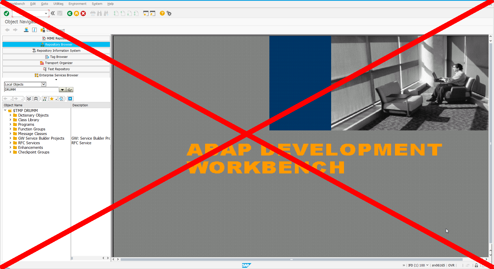
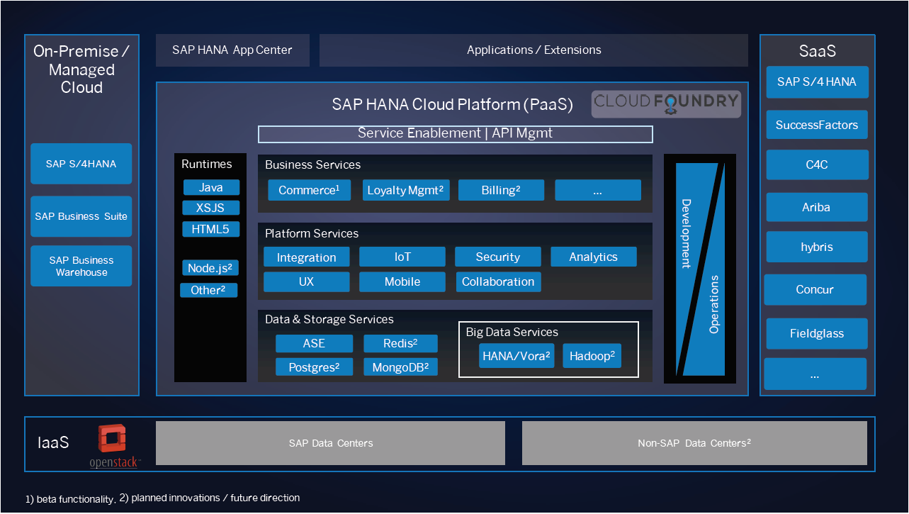
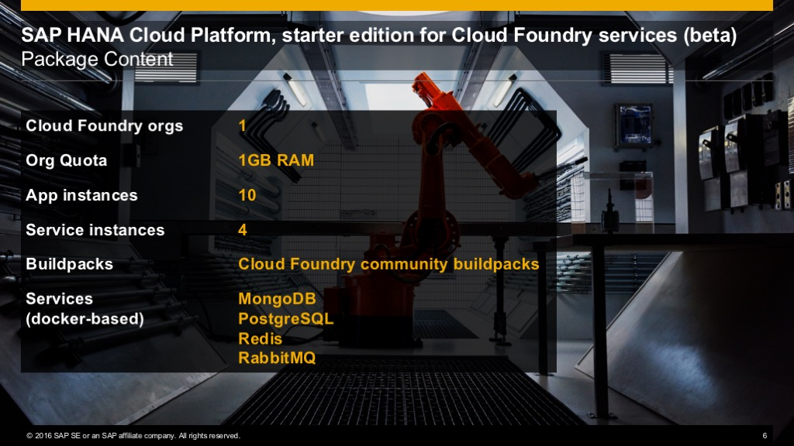

# Agenda
1. [Disclaimer](#/2)
1. [Introduction](#/3)
1. [CF Service on HCP](#/4)
1. [Demo](#/6)


# Disclaimer
This talk is **not** about running **ABAP** on HCP



**Sorry**


# Introduction

* Lots of announcements around SAPPHIRE NOW
* One announcement did not get a lot of attention

> Cloud Foundry services are available as beta on SAP HANA Cloud Platform


# CF Services on HCP
Planned SAP HCP architeture 



## CF Services Beta Package Content



## CF Services available in the Beta
* [Services](https://uacp2.hana.ondemand.com/viewer/#/hcp_cf/4687cee96d4d45a09a92072b84e722f9.html) available trough marketplace
  * Redis
  * RabbitMQ
  * MongoDB
  * PostgreSQL
* [Clound Foundry build packs](http://docs.cloudfoundry.org/buildpacks/)
  * Java
  * Node.js
  * Go
  * PHP
* **Custom build packs**


# Demo
<!-- .slide: data-background="images/demo.png" -->
Demo


##Demo Cheat Sheet
1. Subscribe to Cloud Foundry Services (Beta) at [https://market.yaas.io/](https://market.yaas.io/)
1. Create new project in [builder](https://builder.yaas.io)
1. Deploy the [app](https://sitbru-demo.cfapps.us10.hana.ondemand.com) using CF command line interface 

``` Bash
cf api https://api.cf.us10.hana.ondemand.com
cf login
cf push sitBRU_Demo -b https://github.com/gogolok/cloudfoundry-buildpack-elixir -c "mix phoenix.server"
```
